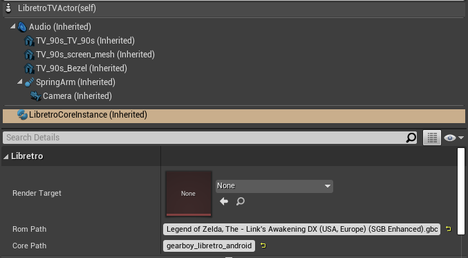

Unfortunately the full Libretro API is quite complex so I have only partially implemented it, so some cores might not work correctly. A non-exhaustive list is documented here.

# Platform Compatibility

# Windows
## Known working cores

* `nestopia        `
* `gearboy         `
* `snes9x          `
* `mupen64plus_next`
* `PPSSPP          ` (Requires [intallation][1] of additional [support files](https://docs.libretro.com/library/ppsspp/#bios))
* `fbalpha2012     `
* `vbam            `
* `desmume2015     `
* `mame            `
* `dosbox_svn      `

## Known broken cores

* `dolphin         `
* `sameboy         `
* `dosbox_pure     ` (This one fails when loading the content)

# Android
I know for certain `gearboy` and `mupen64plus_next` work so I'd try testing those first. I'll probably try to set up automated regression tests in the future so a list can be automatically maintained.

# How to run the right cores for the right platform
You could manually come up with a way to do this, but the way I provide will package the right cores for the right platform as well. Also I'm pretty sure this would be kind of nasty to do in Blueprints.
```
📦UnrealLibretro
 ┣ 📂MyCores
 ┃ ┣ 📂Android
 ┃ ┃ ┣ 📂arm64-v8a
 ┃ ┃ ┃ ┣ 📜gearboy_libretro_android.so
 ┃ ┃ ┃ ┗ 📜mupen64plus_next_gles3_libretro_android.so
 ┃ ┃ ┗ 📂armeabi-v7a
 ┃ ┃   ┣ 📜gearboy_libretro_android.so
 ┃ ┃   ┗ 📜mupen64plus_next_gles3_libretro_android.so
 ┃ ┗ 📂Win64
 ┃   ┣ 📜gearboy_libretro_android.dll
 ┃   ┗ 📜mupen64plus_next_gles3_libretro_android.dll
 ┃
 ┗ 📂MyROMs
   ┣ 📜baserom.us.z64
   ┗ 📜Legend of Zelda, The - Link's Awakening DX (USA, Europe) (SGB Enhanced).gbc
 ```

 If the directory structure of `MyCores` and `MyROMs` looks like this then if you specify *Core Path* as the name of the core without the extension as is done in this image

 

 Then it should load the right Libretro Core for the corresponding platform i.e. on an x86_64 Windows machine it loads `MyCores/Win64/gearboy_libretro_android.dll` (Ignore the fact it says Android I just changed it so the name was the same)

[1]: README.md#sometimes-required-download-content-folder